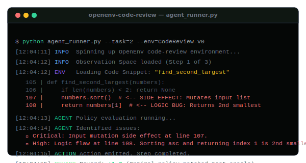

# <p align="center"></p>

<p align="center">
  <a href="https://portfolio-eight-phi-11kqxzic8l.vercel.app"><b>Portfolio Website</b></a> &nbsp;•&nbsp;
  <a href="mailto:nirnayyysingh@gmail.com"><b>Email</b></a> &nbsp;•&nbsp;
  <a href="https://linkedin.com/in/nirnay-pratap-singh-05244129b"><b>LinkedIn</b></a>
</p>

<p align="center"></p>

## ⚡ The Developer Manifesto

> **I do not build tutorials; I build products.**  
> As a B.Tech Computer Science student, AI Engineer, and Startup Founder, I focus on the intersection of **Autonomous Agents, Geopolitical Intelligence, and Distributed Systems**. I believe in writing code that is clean, secure, and production-grade.

<br>

<table width="100%" border="0" cellpadding="0" cellspacing="0">
  <tr>
    <td width="50%" valign="top">
      <h3>🚀 What I'm Building Now</h3>
      <ul>
        <li><b>VeriPolicy Core:</b> Refining the RAG pipelines and ingestion infrastructure for AI-powered geopolitical scenario tracking.</li>
        <li><b>Multi-Agent Systems:</b> Standardizing the communication protocols in agentic environments.</li>
      </ul>
    </td>
    <td width="50%" valign="top">
      <h3>🎯 Active Focus Areas</h3>
      <ul>
        <li><b>Reinforcement Learning:</b> Graded RL environments for training security-first code agents.</li>
        <li><b>Cloud Infrastructure:</b> Serverless distributed pipelines on AWS and GCP.</li>
      </ul>
    </td>
  </tr>
</table>

<br>
<p align="center"></p>

## 🛠️ Flagship Systems

### 1. [VeriPolicy](https://github.com/nirnayyy/VeriPolicy) — AI Geopolitical Platform
*AI-powered policy intelligence platform for real-time geopolitical monitoring, historical analogy retrieval, and impact analysis.*
* **Architecture:** React/Next.js client + FastAPI backend + Vector Embeddings + Supabase.
* **Core Pipeline:** Ingests global news -> Categorizes using classification LLMs -> Stores in Supabase -> Generates foresight impact briefs via RAG.
* **Link:** [veri-policy.vercel.app](https://veri-policy.vercel.app)

### 2. [openenv-code-review](https://github.com/nirnayyy/openenv-code-review) — RL Review Environment
*An OpenAI Gym-compatible reinforcement learning environment designed for training and benchmarking code review agents.*
* **Architecture:** Python + Gymnasium + FastAPI + OpenEnv.
* **Focus:** Benchmarks agents across structural bugs (typos), logic mutation side effects, and security vulnerabilities.
* **Visual Status:**
<p align="left"></p>

### 3. [air-sentinel](https://github.com/nirnayyy/air-sentinel) — Air Quality Forecasting
*Predictive dashboard providing air quality forecasting and historical analysis.*
* **Architecture:** React + Vite + TypeScript + Tailwind CSS + Framer Motion.
* **Capabilities:** Leverages meteorological forecasting models to analyze air trends and trigger alerts.

### 4. [LabourLink](https://github.com/nirnayyy/LabourLink) — Casual Work Connection Portal
*A streamlined platform designed to connect local employers and blue-collar/casual workers.*
* **Architecture:** JavaScript + Tailwind CSS + HTML + Express Backend.
* **Portal Sections:** Worker listings, client posting portal, reviews verification system.

<br>
<p align="center"></p>

## 💻 Tech Stack & Architecture

```yaml
AI & Data Engineering:
  Frameworks:  [PyTorch, OpenAI API, LangChain, LlamaIndex]
  Vector DBs:  [Supabase pgvector, Pinecone, Chroma]
  Agents:      [Gymnasium, OpenEnv, Custom Actor-Critic Models]

Cloud & Architecture:
  Infrastructure: [AWS EC2/S3/RDS, Google Cloud Run, Vercel]
  CI/CD & DevOps: [Docker, GitHub Actions, Linux Shell, Git]
  Databases:      [PostgreSQL, Supabase, Redis, MongoDB]

Full Stack Engineering:
  Languages:   [TypeScript, Python, JavaScript, C++, SQL, CSS]
  Frameworks:  [Next.js, React, Node.js, FastAPI, Express]
```

<br>
<p align="center"></p>

## 📊 Analytics & Insights

<p align="center">
  
  
</p>

<br>
<p align="center"></p>

<p align="center">
  <font color="#737373" size="2">
    © 2026 Nirnay Pratap Singh. Built with intention.
  </font>
</p>
