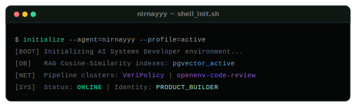
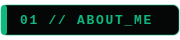
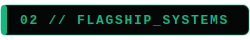
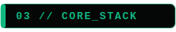
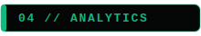
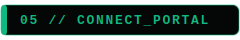

<div align="center">
  
  <!-- 🎯 BRAND HEADER BANNER -->
  
  
  <br/>
  
  <!-- 📊 DYNAMIC PROFILE BADGES -->
  <a href="https://github.com/nirnayyy">
    
  </a>
  &nbsp;
  <a href="https://github.com/nirnayyy?tab=repositories">
    
  </a>
  &nbsp;
  <a href="https://github.com/nirnayyy?tab=followers">
    
  </a>
  &nbsp;
  <a href="https://github.com/nirnayyy">
    
  </a>
  
</div>

<br/>

<!-- 🖥️ TERMINAL INIT SECTION -->
<div align="center">
  
</div>

<br/>


<br/>

<!-- 👤 ABOUT ME SECTION -->


<br/><br/>

<table width="100%">
<tr>
<td width="55%" valign="top">

### ⚡ Technical Overview

```yaml
identity:
  name: Nirnay Pratap Singh
  role: AI Systems & Cloud Product Engineer
  status: B.Tech CSE Student & Startup Founder

areas_of_expertise:
  - 🤖 Autonomous Agents & RL Environments
  - 🔍 RAG Architecture & Vector Search
  - 🌐 High-Performance Full-Stack Engines
  - ☁️ Pipeline DevOps & Container Deployment
  - 🐍 Python / TypeScript Systems

engineering_focus:
  - "Building functional products instead of tutorials"
  - "Security-first distributed microservice models"
```

</td>
<td width="45%" valign="top">

### 🚀 Active Directions

- 🔬 **Researching** multi-agent RL policy optimization and structured reward engineering.
- 🦾 **Developing** geopolitical predictive simulation engines and real-time news data crawlers.
- ⚡ **Deploying** microservices using Docker, Vercel, Supabase, and AWS pipelines.
- 🌱 **Breaking boundaries** on standard text benchmarks with localized prompt RAG retrieval.
- ☕ **Fueled by** clean syntax, vector embeddings, and caffeine.

</td>
</tr>
</table>

<br/>


<br/>

<!-- 🏆 FLAGSHIP SYSTEMS SECTION -->


<br/><br/>

### 1. [VeriPolicy](https://github.com/nirnayyy/VeriPolicy) — Geopolitical Scenario Modeler
*AI-powered policy intelligence platform for real-time geopolitical tracking, historical analogy retrieval, and impact simulation.*
*   **Engine:** Ingests live news feeds, classifies events via NLP models, stores vectors in Supabase, and generates foresight briefings.
*   **Stack:** Next.js + FastAPI + Supabase pgvector + OpenAI Embeddings.
*   **Production Deployment:** [veri-policy.vercel.app](https://veri-policy.vercel.app)

<br/>

### 2. [openenv-code-review](https://github.com/nirnayyy/openenv-code-review) — RL Review Environment
*An OpenAI Gym-compatible reinforcement learning environment designed for training and benchmarking code review agents.*
*   **Features:** Evaluates LLM action policies across syntax, logic mutation, and security vulnerabilities (SQL injections).
*   **Stack:** Python + Gymnasium + FastAPI + OpenEnv CLI.
*   **Visual Execution Console:**
<div align="left">
  
</div>

<br/>

### 3. [air-sentinel](https://github.com/nirnayyy/air-sentinel) — Air Quality Forecasting
*Meteorological predictive dashboard tracking air indices, particulate trends, and region-based notifications.*
*   **Stack:** React + Vite + TypeScript + Tailwind CSS + Framer Motion.

<br/>

### 4. [LabourLink](https://github.com/nirnayyy/LabourLink) — Casual Work Job Board
*A community-first recruitment platform bridging daily wage/casual workers directly with local employers.*
*   **Stack:** JavaScript + Tailwind CSS + Express Backend + Vercel Serverless Routing.

<br/>


<br/>

<!-- ⚡ TECH STACK SECTION -->


<br/><br/>

<div align="center">

  <!-- Languages -->
  <h4>💻 Languages &amp; Core</h4>
  <p>
    
  </p>

  <!-- AI & Data -->
  <h4>🤖 AI &amp; RAG Engineering</h4>
  <p>
    
  </p>

  <!-- Web Dev -->
  <h4>🌐 Web Development</h4>
  <p>
    
  </p>

  <!-- Databases & DevOps -->
  <h4>🔧 Databases, Cloud &amp; DevOps</h4>
  <p>
    
  </p>

</div>

<br/>


<br/>

<!-- 📊 ANALYTICS SECTION -->


<br/><br/>

<div align="center">
  
  <a href="https://github.com/nirnayyy">
    
  </a>
  &nbsp;
  <a href="https://github.com/nirnayyy">
    
  </a>
  
</div>

<br/>


<br/>

<!-- 🌐 CONNECT WITH ME SECTION -->


<br/><br/>

<div align="center">
  
  <a href="https://github.com/nirnayyy" target="_blank">
    
  </a>
  &nbsp;
  <a href="https://linkedin.com/in/nirnay-pratap-singh-05244129b" target="_blank">
    
  </a>
  &nbsp;
  <a href="mailto:nirnayyysingh@gmail.com">
    
  </a>
  &nbsp;
  <a href="https://portfolio-eight-phi-11kqxzic8l.vercel.app" target="_blank">
    
  </a>
  
</div>

<br/>


<br/>

<div align="center">
  
  <br/>
  <sub>© 2026 Nirnay Pratap Singh. Built with intention.</sub>
</div>
